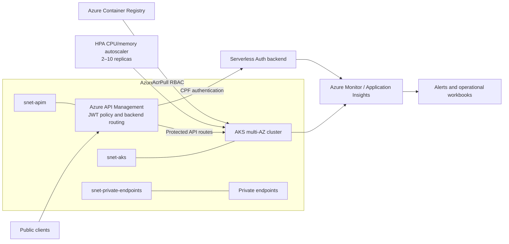

# CatCar - Kubernetes & Platform Infrastructure (`catcar-kubernetes-infra`)

Terraform Infrastructure as Code (IaC) repository provisioning core networking, container orchestration (AKS), container registry (ACR), API Gateway (APIM), and Azure Monitor observability alerting for the CatCar platform.

---

## Provisioned Infrastructure

- **Networking**: Azure Virtual Network (`vnet-catcar-*`) with subnets for AKS (`snet-aks`), API Management (`snet-apim`), and Private Endpoints (`snet-private-endpoints`).
- **Container Orchestration**: Azure Kubernetes Service (AKS) with Azure CNI, Workload Identity, Microsoft Entra RBAC, and Container Insights.
- **Container Registry**: Azure Container Registry (ACR) configured with automated RBAC `AcrPull` bindings to AKS kubelet identity.
- **API Gateway**: Azure API Management (APIM) with custom XML policies (`apim-policy.xml`) routing public traffic to AKS backend and serverless Auth Function.
- **Observability & Alerting (`alerts/`)**: Log Analytics Workspace, Application Insights, Action Groups, Scheduled Query Alert rules, Metric Alerts (CPU, Memory, Latency > 2s), and synthetic readiness uptime probes.

## Dedicated Network & Kubernetes Architecture



Terraform establishes the network boundaries and Kubernetes control plane: a multi-availability-zone AKS cluster in `snet-aks`, APIM in `snet-apim`, private service connectivity in `snet-private-endpoints`, workload autoscaling from 2 to 10 replicas, ACR image pulls through RBAC, and centralized telemetry, alerts, and workbooks.

## APIM Routing & Postman Integration

APIM is the public routing boundary: it applies the JWT policy, routes `POST /api/auth/customer` to the serverless authentication backend, and routes protected platform APIs to AKS.

- **Swagger UI through the platform API:** [http://localhost:5000/swagger](http://localhost:5000/swagger)
- **Scalar API Reference:** [http://localhost:5000/docs](http://localhost:5000/docs)
- **OpenAPI v3 JSON:** [http://localhost:5000/openapi/v1.json](http://localhost:5000/openapi/v1.json)
- **Versioned Postman collection:** [`CatCar_Platform.postman_collection.json`](https://github.com/RiseOn-CatCar/catcar-platform/blob/main/docs/postman/CatCar_Platform.postman_collection.json)
- **Postman environment template:** [`CatCar_Platform.postman_environment.json`](https://github.com/RiseOn-CatCar/catcar-platform/blob/main/docs/postman/CatCar_Platform.postman_environment.json)

Set `apimUrl` in the Postman environment to the APIM gateway URL to exercise the policy and backend routing; keep `baseUrl` pointed at the API host for direct local health checks.

---

## Repository Structure

```
.
├── main.tf                    # Core network, AKS, ACR, APIM resources
├── variables.tf               # Input parameters and defaults
├── outputs.tf                 # Cluster and gateway outputs
├── apim-policy.xml            # API Management global routing and JWT validation policy
├── alerts/
│   └── catcar-alerts.tf       # Metric alerts, action groups, query rules, web tests
├── scripts/
│   └── bootstrap-azure.sh     # Script to provision Azure control-plane and GitHub OIDC
├── docs/
│   └── azure-bootstrap.md     # Step-by-step setup documentation
└── .github/workflows/ci-cd.yml # Automated lint, validation, and multi-environment apply
```

---

## Local Validation

```bash
# Validate core infrastructure
terraform init -backend=false
terraform fmt -check -recursive
terraform validate

# Validate alerts infrastructure
cd alerts
terraform init -backend=false
terraform fmt -check -recursive
terraform validate
```

---

## CI/CD Pipeline

- **Pull Requests**: Runs `terraform fmt` and `terraform validate` on both core and alerts modules.
- **Push to `develop`**: Applies changes to **Homologation** environment with state keys `homolog-catcar-kubernetes.tfstate` and `homolog-catcar-alerts.tfstate`.
- **Push to `main`**: Applies changes to **Production** environment with state keys `catcar-kubernetes.tfstate` and `catcar-alerts.tfstate`.
